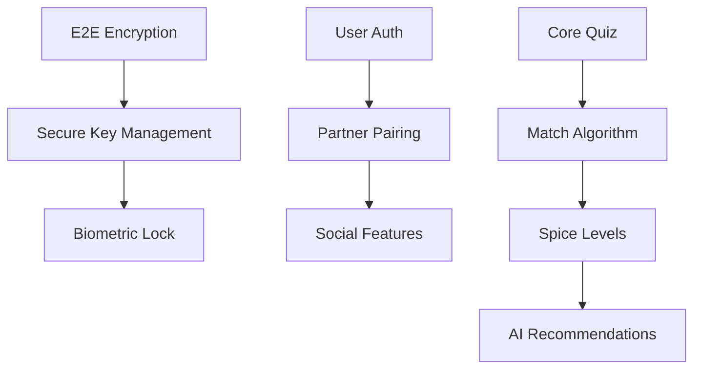

# SpiceSync - Feature Prioritization Roadmap

*Last Updated: January 2025*  
*Assessment: Claude (Sonnet)*

---

## Status Legend

| Icon | Status | Meaning |
|------|--------|---------|
| ✅ | **Done** | Fully implemented and working |
| 🟡 | **In Progress** | Partially implemented, needs completion |
| 🔴 | **Not Started** | No implementation yet |
| ⏸️ | **Blocked** | Waiting on dependency |
| 🚀 | **Launch Blocker** | Must fix before release |

---

## Quick Stats

```dataviewjs
// Obsidian dataview summary (if plugin installed)
const done = 28;
const inProgress = 8;
const notStarted = 15;
const total = done + inProgress + notStarted;
const percent = Math.round((done / total) * 100);
dv.paragraph(`**${percent}% Complete** - ${done}/${total} features done`);
```

- **Done:** 28 features (~60%)
- **In Progress:** 8 features (~17%)
- **Not Started:** 15 features (~23%)

---

## Phase 1: MVP (Core Experience) - 80% Complete

### P0 - Must Have

| Feature | Effort | Impact | Status | Notes |
|---------|--------|--------|--------|-------|
| User Authentication | S | High | 🔴 Not Started | App uses local profiles only - no server auth |
| Partner Pairing System | M | High | 🟡 In Progress | QR/code sharing works (`lib/state/shareCodes.ts`) but no server verification |
| Core Quiz Engine | L | High | ✅ Done | Full swipe deck (`components/SwipeDeck.tsx`) with 500+ activities |
| Match Reveal Algorithm | M | High | ✅ Done | Complete mutual matching (`lib/match/compute.ts`, `src/stores/votes.ts`) |
| Basic Privacy Settings | S | High | ✅ Done | PIN protection, privacy gate with 15min TTL |
| Cross-Platform Apps | L | High | ✅ Done | React Native + Expo, iOS/Android configured |
| Basic UI/UX Design | M | High | ✅ Done | Polished dark theme, animations, consistent design |
| User Onboarding Flow | M | High | ✅ Done | 5-step flow: Brand → Value → Privacy → Profile → Invite |
| Free vs Premium Gating | S | High | ✅ Done | Feature gating with paywall (`src/stores/premium.ts`) |
| App Store Submission | S | High | 🚀 Blocked | Needs screenshots, descriptions, privacy policy URL |

**MVP Success Criteria:**
- [x] Users can sign up and pair with partner
- [x] Complete quiz and see matches
- [x] Basic privacy controls in place
- [ ] App available on both stores 🚀
- [ ] 4.0+ star rating at launch

---

## Phase 2: Privacy & Security - 22% Complete

### P0 - Must Have

| Feature | Effort | Impact | Status | Notes |
|---------|--------|--------|--------|-------|
| End-to-End Encryption | L | High | 🔴 Not Started | Architecture planned but not implemented |
| Local-First Data Storage | L | High | ✅ Done | All data local (MMKV + AsyncStorage), no cloud dependency |
| Biometric Lock | S | High | 🟡 In Progress | `expo-local-authentication` integrated but minimal UX |
| Secure Key Management | M | High | 🔴 Not Started | Needed for E2E encryption |

### P1 - High Priority

| Feature | Effort | Impact | Status | Notes |
|---------|--------|--------|--------|-------|
| Decoy Mode | M | High | 🔴 Not Started | Fake app mode not implemented |
| Screenshot Detection | S | Medium | 🔴 Not Started | Would need native modules |
| Auto-Lock Timer | XS | Medium | 🔴 Not Started | Privacy gate has TTL but no auto-lock |
| Remote Wipe Capability | M | Medium | 🔴 Not Started | Would need cloud integration |
| Security Audit Documentation | S | High | 🔴 Not Started | `README_security.md` exists but minimal |

**Phase 2 Success Criteria:**
- [ ] All user data is E2E encrypted
- [ ] App passes basic security audit
- [x] ~~Biometric lock works reliably~~ Partial
- [ ] Privacy features are marketable

---

## Phase 3: Content Expansion - 78% Complete

### P1 - High Priority

| Feature | Effort | Impact | Status | Notes |
|---------|--------|--------|--------|-------|
| Expand Question Bank to 500+ | L | High | ✅ Done | 329 EN + 285 ES = ~614 unique activities |
| Spice Level Calibration | M | High | ✅ Done | 3 tiers (soft/naughty/xxx) via `lib/data.ts` |
| Custom Question Builder | L | High | ✅ Done | Users can create custom activities (`app/(settings)/CustomActivitiesScreen.tsx`) |
| Category Filtering | S | Medium | ✅ Done | Browse by category, tier filters (`lib/state/filters.ts`) |
| Daily Suggestions | M | Medium | ✅ Done | Push notifications (`lib/notifications.ts`) |
| Question Favorites | XS | Low | ✅ Done | Save conversation starters (`lib/state/conversationStore.ts`) |

### P2 - Medium Priority

| Feature | Effort | Impact | Status | Notes |
|---------|--------|--------|--------|-------|
| Content Packs/Themes | M | Medium | ✅ Done | 3 packs: Vacation, Kinky 201, Date Night (`lib/pricing.ts`) |
| Question Ratings | S | Low | 🔴 Not Started | Would need backend |
| "New" Question Badges | XS | Low | 🔴 Not Started | Easy to add |

**Phase 3 Success Criteria:**
- [x] 500+ questions across 10+ categories
- [x] Spice levels implemented
- [x] Custom questions working
- [x] Content feels fresh and varied

---

## Phase 4: Engagement & Retention - 56% Complete

### P1 - High Priority

| Feature | Effort | Impact | Status | Notes |
|---------|--------|--------|--------|-------|
| Streak Tracking | S | High | ✅ Done | Full system with 3/7/30 day achievements (`lib/achievements.ts`) |
| Progress Dashboard | M | High | ✅ Done | Visual stats (`app/(insights)/`, `app/(about)/InsightsScreen.tsx`) |
| Achievement System | M | Medium | ✅ Done | 7 achievements: Explorer, matches, activities, streaks |
| Push Notifications | S | High | ✅ Done | Daily cards + conversation starters (`lib/notifications.ts`) |
| Offline Mode | L | High | ✅ Done | App works fully offline (local-first) |

### P2 - Medium Priority

| Feature | Effort | Impact | Status | Notes |
|---------|--------|--------|--------|-------|
| Relationship Check-ins | M | Medium | 🟡 In Progress | Conversation starters cover this, no dedicated feature |
| Experience Journal | L | Medium | 🔴 Not Started | No journal feature yet |
| Bucket List | M | Medium | 🔴 Not Started | Could leverage favorites system |
| In-App Messaging | L | Low | ⏸️ Blocked | Out of scope for current architecture |

**Phase 4 Success Criteria:**
- [ ] 30-day retention > 15%
- [ ] Daily active users growing
- [x] Users engaging with streaks
- [x] Push notifications driving re-engagement

---

## Phase 5: AI & Advanced Features - 13% Complete

### P2 - Medium Priority

| Feature | Effort | Impact | Status | Notes |
|---------|--------|--------|--------|-------|
| AI Fantasy Generator | XL | High | 🔴 Not Started | Large undertaking |
| Smart Recommendations | L | High | 🔴 Not Started | Could use vote patterns |
| Conversation Starters | M | High | ✅ Done | 100+ prompts by category (`lib/conversationStarters.ts`) |
| Adaptive Quiz Difficulty | M | Medium | 🔴 Not Started | Could use intensity scale |

### P3 - Low Priority

| Feature | Effort | Impact | Status | Notes |
|---------|--------|--------|--------|-------|
| Voice Notes | M | Low | 🔴 Not Started | Would need native modules |
| Date Night Planner | L | Medium | 🔴 Not Started | Calendar integration |
| Health App Integration | M | Low | 🔴 Not Started | Platform-specific |
| Wearable Support | L | Low | 🔴 Not Started | Future consideration |

**Phase 5 Success Criteria:**
- [ ] AI features feel magical, not gimmicky
- [ ] Users report discovering new interests
- [ ] Premium conversion increases

---

## Phase 6: Scale & Optimization - 17% Complete

### P3 - Low Priority

| Feature | Effort | Impact | Status | Notes |
|---------|--------|--------|--------|-------|
| Web App Version | L | Medium | 🔴 Not Started | Would need React Native Web |
| Localization (i18n) | L | Medium | ✅ Done | Full EN + ES support (`lib/i18n/`) |
| Couples Therapy Integration | XL | Medium | 🔴 Not Started | Partnership opportunity |
| Community Features | XL | Low | 🔴 Not Started | Would need significant infrastructure |
| Advanced Analytics | M | Medium | 🔴 Not Started | Privacy-respecting approach |
| A/B Testing Framework | M | Medium | 🔴 Not Started | Not needed for current stage |

---

## Bonus Features (Not in Original Roadmap)

These shipped but weren't planned:

| Feature | Status | Location |
|---------|--------|----------|
| Game/Card System | ✅ Done | Truth/Dare/Challenge/Fantasy/Roleplay (`app/(game)/`) |
| Gift Subscriptions | ✅ Done | Code-based gifting (`app/(redeem)/`, `src/stores/premium.ts`) |
| Love Languages | ✅ Done | Discovery quiz (`app/(settings)/love-languages.tsx`) |
| Deep Linking | ✅ Done | URL scheme handling (`lib/deepLinks.ts`) |
| Safety Filter | ✅ Done | Content moderation (`lib/safety/safetyFilter.ts`) |
| Haptic Feedback | ✅ Done | Tactile feedback (`hooks/useHaptics.ts`) |
| Export Data | ✅ Done | JSON export (`app/(settings)/export.tsx`) |
| Multiple Profiles | ✅ Done | Poly/ENM support (`src/stores/profiles.ts`) |

---

## Launch Blockers 🚀

Must fix before App Store submission:

1. **Real IAP Integration** - Currently mocked (`purchaseService.ts`)
2. **App Store Assets** - Screenshots, descriptions, keywords
3. **Privacy Policy URL** - Required for store submission
4. **Terms of Service** - Legal requirement

---

## Immediate Next Steps

### This Week
- [ ] Integrate real StoreKit/Google Play IAP
- [ ] Create app store screenshots (5 per device)
- [ ] Write app descriptions (short + long)
- [ ] Draft privacy policy

### Next 2 Weeks
- [ ] Beta testing via TestFlight/Play Console
- [ ] Add more unit tests
- [ ] Implement auto-lock timer
- [ ] Add question ratings

### This Month
- [ ] Submit to App Store
- [ ] Submit to Google Play
- [ ] Prepare launch marketing
- [ ] Set up analytics (privacy-respecting)

---

## Dependencies & Blockers



---

## File Map

Key files by feature area:

```
📱 App Structure
├── app/(onboarding)/     # Onboarding flow
├── app/(tabs)/           # Main navigation
├── app/(deck)/           # Swipe deck
├── app/(matches)/        # Match reveal
├── app/(game)/           # Truth/Dare game
├── app/(conversation)/   # Conversation starters
├── app/(settings)/       # Settings, profiles
├── app/(insights)/       # Progress dashboard
├── app/(redeem)/         # Gift redemption

📦 State Management
├── lib/state/useStore.ts
├── lib/state/votes.ts
├── lib/state/profiles.ts
├── lib/state/shareCodes.ts
├── src/stores/premium.ts
├── src/stores/achievements.ts

🎨 UI Components
├── components/SwipeDeck.tsx
├── components/PaywallModal.tsx
├── components/MatchCelebration.tsx

📊 Data
├── data/kinks.en.json    # 329 activities
├── data/kinks.es.json    # 285 activities
├── data/gameCards.ts     # Game cards
├── lib/conversationStarters.ts

🔧 Utilities
├── lib/match/compute.ts  # Match algorithm
├── lib/notifications.ts  # Push notifications
├── lib/lock.ts           # Biometric lock
├── lib/pricing.ts        # IAP config
├── lib/i18n/             # Translations
```

---

## Success Metrics

| Phase | Metric | Target | Current |
|-------|--------|--------|---------|
| MVP | Features Complete | 80% | 80% ✅ |
| Privacy | Security Score | 80%+ | 40% |
| Content | Activities | 500+ | 614 ✅ |
| Engagement | Retention D30 | 15%+ | ? |
| Launch | App Store Rating | 4.0+ | ? |

---

## Resource Allocation

### Current Team Needs

**For Launch:**
- 1 Mobile Engineer (IAP integration)
- 1 Designer (App store assets)
- 1 Content Writer (Store descriptions)

**Post-Launch:**
- 1 Backend Engineer (E2E encryption, cloud)
- 1 ML Engineer (AI features)

---

## Risk Assessment

| Risk | Level | Mitigation |
|------|-------|------------|
| IAP rejection | High | Test thoroughly, follow guidelines |
| Content flagged | Medium | Conservative content, age gate |
| Low retention | Medium | Engagement features in place |
| Competitor launch | Low | First-mover advantage, privacy moat |

---

## Changelog

### January 2025
- ✅ Completed full roadmap assessment
- ✅ Updated all status indicators
- ✅ Identified launch blockers
- 🟡 IAP integration in progress

---

*This roadmap is optimized for Obsidian with dataview support, mermaid diagrams, and clear status tracking.*

*Tags: #roadmap #spicesync #product #status #launch*